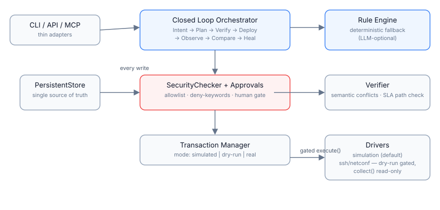

# NetMind

**Intent-driven network operations agent — from natural language intent to verified, rollback-safe policy changes.**
**意图驱动的网络自治运维 Agent：从自然语言意图到可验证、可回滚的策略变更。**

> **Status: alpha · simulation-first.** The closed-loop workflow (intent → plan → verify → deploy → telemetry → diagnose → heal) is fully implemented against a built-in simulator and works offline with zero external dependencies. Real-device drivers ship behind an explicit opt-in flag and are read-only by default. See [Honesty table](#whats-real--whats-simulated).
>
> **状态：alpha · 仿真优先。** 意图→规划→验证→下发→遥测→诊断→自愈的完整闭环已在内置仿真器上跑通，离线零依赖可用。真实设备驱动默认只读、需显式开启，边界见[诚实声明](#真实与仿真的边界)。

## Why

Network operations still run on tribal knowledge and hand-typed CLI. Intent-Based Networking (IBN) fixes the *interface*; agentic AI fixes the *loop*: parse what the operator wants, propose a change, prove it is safe, apply it under approval, watch the result, and heal when reality disagrees.

NetMind implements that loop end to end as a small, hackable Python service — the "diagnose-and-heal" counterpart that projects like K8sGPT brought to Kubernetes, aimed at networks.

网络运维至今仍依赖口口相传的经验和手敲命令行。基于意图的网络（IBN）解决"接口"问题，Agent AI 解决"闭环"问题：解析运维者想要什么 → 提出变更 → 证明安全 → 审批后下发 → 观测结果 → 与预期不符时自愈。NetMind 把这条闭环做成了一个轻量可改的 Python 服务。

## Features

- Closed-loop workflow: `IntentAgent → PlannerAgent → VerifierAgent → DeployAgent → TelemetryAgent → DiagnosisAgent → HealingAgent`
- LLM-optional: offline rule engine fallback; OpenAI-compatible presets for DeepSeek / Qwen / OpenAI / Ollama
- LangGraph adapter: uses real LangGraph when installed, falls back to a built-in compatible engine
- MCP-style tool registry with 24 built-in tools, 4 workflows, cross-domain negotiation
- Policy conflict detection, auto-fix suggestions, approval flow, transactional rollback plans
- Audit log, notifications, compliance reports (MD / HTML / PDF)
- React dashboard (9 pages) + WebSocket live events

## What's real / What's simulated

| Capability | State |
|---|---|
| Workflow orchestration, conflict detection, approvals, reports | ✅ Real |
| Offline rule engine + mock model | ✅ Real (zero-dependency demo) |
| Real LLM calls (DeepSeek / Qwen / OpenAI / Ollama presets) | ✅ Real (API key required) |
| Topology & telemetry data | ⚠️ Simulated generator |
| Policy deployment on devices | ⚠️ Dry-run by default; real SSH/NETCONF behind `NETMIND_ENABLE_REAL_COMMANDS=true` + credentials |
| Read-only device collection (`collect()`) | ✅ Real via napalm / ncclient (`requirements-drivers.txt`) |

We keep this table in the README on purpose: if a capability moves from simulated to real, this file must say so.

我们刻意把这张表放在 README 里：任何能力从仿真转为真实，此表必须同步更新。

## Quick start

```bash
docker compose up -d --build
```

- Dashboard: http://localhost:5173
- API docs: http://localhost:8000/docs

### Local development

```bash
cd backend
python -m venv .venv && source .venv/bin/activate
pip install -r requirements.txt
uvicorn app.main:app --reload

cd ../frontend && npm ci && npm run dev
```

Optional real-device drivers:

```bash
pip install -r backend/requirements-drivers.txt   # napalm, netmiko, ncclient
```

Install as a package (provides the `netmind` CLI):

```bash
pip install ./backend        # or: pipx install ./backend
netmind --help
```

## Demo

No hardware needed — validate a containerlab topology straight from its YAML:

```console
$ netmind diagnose examples/clab-broken.yml
# NetMind Diagnose Report: netmind-broken

- 模式：`structure-only`
- 规模：3 nodes / 2 links
- 结论：**3 error(s), 1 warning(s)**

## Findings

### [ERROR] Link endpoint references unknown node "ghost" `dangling:ghost`
Endpoint ghost:eth0 has no matching topology node.

### [ERROR] Address conflict: 10.0.0.1 assigned to both r1 and r2 `ip-conflict:10.0.0.1`
Duplicate addressing causes unreachable hosts and ARP churn.

### [WARN] Topology splits into 2 isolated groups `isolation`
Groups: lonely | r1, r2.
```

Clean topologies report `clean`; add `--live` for interface state via napalm, `--llm` for root-cause analysis.

## Configuration

| Variable | Default | Description |
|---|---|---|
| `NETMIND_DRIVER` | `simulation` | Active driver: `simulation` \| `ssh` \| `netconf` |
| `NETMIND_ENABLE_REAL_COMMANDS` | `false` | Gate for any write execution against real devices |
| `NETMIND_ADMIN_TOKEN` | – | When set, all non-GET requests require `Authorization: Bearer <token>` |
| `NETMIND_CORS_ORIGINS` | `*` | Comma-separated allowed origins |
| `NETMIND_SSH_HOST` / `_PORT` / `_USERNAME` / `_PASSWORD` / `_DEVICE_TYPE` | – | netmiko connection settings |
| `NETMIND_NAPALM_DRIVER` | SSH device type | napalm driver name for read-only collection |
| `NETMIND_NETCONF_HOST` / `_PORT` / `_USERNAME` / `_PASSWORD` | – | ncclient endpoint settings |
| `DEEPSEEK_API_KEY` / `OPENAI_API_KEY` | – | Optional LLM backends |

## Architecture



- `backend/app/routers/` — API modules by domain
- `backend/app/core/` — orchestration, verification, telemetry, MCP tools
- `backend/app/drivers/` — device abstraction (`execute()` gated, `collect()` read-only)

## Testing

```bash
cd backend && pytest -q
python scripts/validate_project.py
```

39 tests cover the full loop; CI runs them on Python 3.10–3.12 plus a frontend build.

## Diagnose (Phase 1)

Validate a containerlab topology without deploying it:

```bash
netmind diagnose examples/clab-demo.yml              # structure checks → markdown report
netmind diagnose examples/clab-broken.yml --json     # machine-readable findings
netmind diagnose topo.yml --live --host r1=172.20.20.2   # + napalm interface state
netmind diagnose topo.yml --llm                      # + LLM root-cause analysis (cached)
```

Checks: dangling link endpoints, duplicate/parallel links, IP conflicts, invalid management addresses, topology isolation. `--llm` sends only the structured findings (never configs) to DeepSeek/OpenAI/Ollama (`NETMIND_DIAGNOSE_MODEL=ollama:qwen2.5`), responses cached in `~/.cache/netmind/`.

## Roadmap

1. ~~**Phase 1 — Diagnose MVP**: `netmind diagnose <containerlab-topology>` — read-only collection over SSH/gNMI, LLM root-cause report.~~ ✅ shipped (structure checks + live collection + cached LLM enrichment)
2. **Phase 2 — Guardrailed healing**: config-diff proposals, pre-apply verification, human approval, post-apply verification, rollback.
3. **Phase 3 — Real MCP server**: expose tools over Model Context Protocol (JSON-RPC stdio) so Claude/Cursor-class agents can operate networks safely.

## License

MIT

## Contributing & Security

- [CONTRIBUTING.md](CONTRIBUTING.md) — setup, ground rules, PR checklist
- [SECURITY.md](SECURITY.md) — threat model and vulnerability reporting
- [CHANGELOG.md](CHANGELOG.md)
