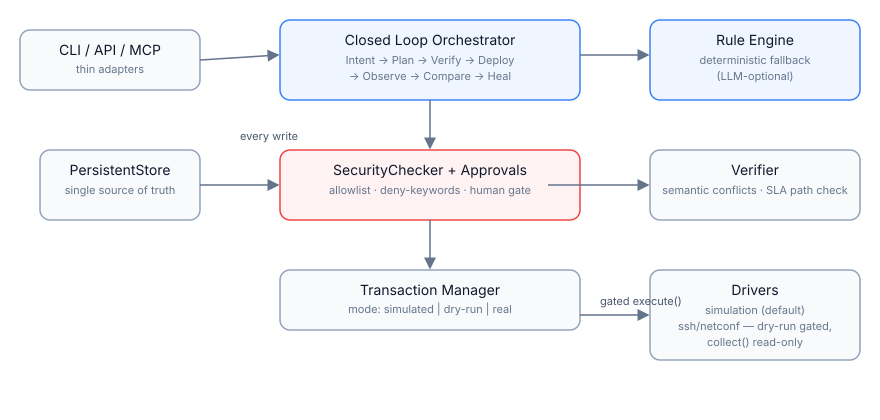

# NetMind

**Intent-driven network operations agent — from natural language intent to verified, rollback-safe policy changes.**
**意图驱动的网络自治运维 Agent：从自然语言意图到可验证、可回滚的策略变更。**

> **Status: alpha · simulation-first.** Real-device drivers are read-only by default and gated behind an explicit flag. / 状态：alpha · 仿真优先；真实设备驱动默认只读、需显式开启。

## Why

Intent-Based Networking fixes the *interface*; agentic AI closes the *loop*: parse intent → propose change → prove safety → apply under approval → observe → heal.
基于意图的网络解决「接口」问题，Agent AI 闭环「执行」问题：解析意图 → 提出变更 → 证明安全 → 审批下发 → 观测自愈。

## Features

- Closed loop: `IntentAgent → PlannerAgent → VerifierAgent → DeployAgent → TelemetryAgent → DiagnosisAgent → HealingAgent`
- LLM optional; offline rule engine fallback (DeepSeek / Qwen / OpenAI / Ollama presets)
- Policy conflict detection, auto-fix, approval flow, transactional rollback
- Read-only router compliance audit (`netmind audit`)
- containerlab topology diagnose (`netmind diagnose`), optional napalm collection and cached LLM analysis
- React dashboard + WebSocket events; MCP server over JSON-RPC stdio (`netmind mcp`)

## What's real / What's simulated

| Capability | State |
|---|---|
| Workflow orchestration, conflict detection, approvals, reports | ✅ Real |
| Config-change proposal (diff, danger marking, reviewable Markdown) | ✅ Real (`core/config_diff.py`, 8 tests) |
| Lab data collection (real ICMP + NIC counters) | ✅ Real (`diagnose/lab_collector.py` + `scripts/lab.sh`, 11 tests on real captures) |
| Routing state | ✅ Real — FRR/zebra 路由表（仅直连+静态，无 OSPF/BGP） |
| Missing measurements | ✅ Never substituted — a ping that lost too many packets to produce an RTT yields `latency_ms: null`, not a sentinel; `diagnose()` then reasons from the loss that *was* measured (80% loss ⇒ `congestion`, not `link_down` on a fabricated 999 ms) and returns `normal` at confidence `0.0` when nothing was measured at all |
| Diagnosis confidence | ✅ Derived — every diagnosis, **including `normal`**, derives confidence from margin-to-threshold, sample count, and whether the data is real or simulated; with no samples at all the verdict is `normal` at confidence `0.0` with a stated reason |
| Diagnosis thresholds | ⚠️ Calibrated on one lab topology; `throughput` judgement needs a baseline and is skipped when absent |
| Post-apply verification | ✅ Real — `diagnose/closed_loop.py`; `success` 由实测前后对比推出，未重测即 `verified=False`（跑测见 `docs/closed-loop-run-report.md`） |
| Healing action | ✅ Real — 处置是真命令而非描述串：过安全门 → TransactionManager 下发 → 重测对比（`core/remediation.py`）；`congestion` 与 `link_down` **两条路径均已在真实设备端到端跑通**（`scripts/verify_heal.py`、`scripts/verify_linkdown.py`），设备侧均以 `qdisc` / 路由表读回作独立佐证；⚠️ `anomaly_traffic` **不做自动处置**——其唯一触发条件是带宽跌幅过半，而原处置是限速（把已经掉下去的带宽再限死一点），方向是反的，已从处置表移除；该诊断仍会照常报出供人工判断；⚠️ **auto-remediation is off unless `NETMIND_HEAL_IFACE` is set** — the interface is never guessed, since guessing wrong targets the wrong port; real production faults unverified |
| Healing safety rails | ✅ Covered — attempts are counted per (diagnosis, interface) and persisted; reaching the cap (default 3, `NETMIND_HEAL_MAX_ATTEMPTS`) stops auto-remediation and hands off to a human; a success clears the count, and a dry run never consumes budget since the device was untouched |
| Offline rule engine + mock model | ✅ Real |
| Real LLM calls | ✅ Real (API key required) |
| Topology & telemetry data | ✅ Real when a probe target is configured (`NETMIND_PROBE_TARGET`) — ICMP from the monitored device; ⚠️ falls back to a **labelled** simulator when no probe target is set (snapshot carries `source=simulated`, diagnosis confidence is discounted accordingly) |
| Policy deployment on devices | ✅ Real — 真 SSH 下发与真回滚已在真实容器上验证（写入→读回确认→回滚→确认失效）；⚠️ 仍默认 dry-run，需显式 `NETMIND_ENABLE_REAL_COMMANDS=true` + 凭据 |
| Read-only device collection / audit | ✅ Real — 能力矩阵见 `diagnose/vendor_matrix.py`（`GET /api/vendors`）；每家厂商带**验证等级**，未知型号**不猜驱动**、如实拒绝 |
| Dependency vulnerabilities | ✅ 0 known (`pip-audit` + `npm audit`, both in CI) |
| Frontend tests | ✅ 92 cases (node built-in runner, no test framework) across `src/lib/`: display decisions, the auth contract, API base resolution, and the request layer, the workflow graph parser, and the topology layout — all three previously had **zero** coverage because they sat inside the JSX entry file, where `node --test` could not import them. Each of those three silently dropped bad input (an unparseable edge vanished; a link to a missing node was drawn to a fabricated coordinate; a same-named node overwrote another). Labelled helpers also refuse to invent device state: a node with neither IP nor status reads **状态未知** rather than 可用, a row with no `source` reads **来源未标注** rather than `system`, and the sidebar's 全网状态 is three-state so it never shows a green **全网正常** before any health check has run |
| Frontend build ≠ correctness | ✅ Evidence, not a claim — misspelling `apiUrl`→`apiPath` inside `request()` left **`npm run build` green** (bundlers do not resolve identifiers inside function bodies) while it would crash on the first API call in a browser; the same typo fails 8 test cases. Gate `frontend-request-layer-is-tested` keeps the request layer in a tested module, requires the two previously-broken behaviours (no bespoke auth header, no default credential) to stay asserted, **and checks every `lib/` call site in `App.jsx` against its declaration's arity** — changing a signature without updating the caller slipped through twice, with build and module tests both green |
| Default security | ✅ Safe by default — no token ⇒ loopback-only (403); token ⇒ all methods incl. GET; `/healthz` public, `/metrics` authenticated |
| Credential tiers | ✅ Two — `NETMIND_ADMIN_TOKEN` (all methods) and `NETMIND_READONLY_TOKEN` (GET/HEAD/OPTIONS; writes get **403**, not 401, because the credential is valid and the role is not); the dashboard reads `auth_mode` from `/api/system/status` and says so up front instead of letting a read-only user click into a 403; ⚠️ **one instance manages one device** — a deployment connects to exactly the host in `NETMIND_SSH_HOST`, so there is no per-device axis to scope (that gap as originally worded assumed a fleet). Within a tier there is no further scoping: an admin can reach every endpoint. `CredentialConfig` records in the store are **not** used to connect — the API says so on every row (`used_for_connection: false`) rather than letting the field names (`host`/`port`/`username`) imply otherwise |
| Self observability | ✅ Real — `/healthz` + `/metrics` (p50/p95/p99 per endpoint, error counts) |
| Lab fixture integrity | ✅ Self-consistent — gate `fixtures-are-self-consistent` requires each ping capture's self-reported `transmitted`/`received` and `round-trip min/avg/max` to match its own reply lines, requires contiguous `seq`, forbids a `round-trip` line in the link-down capture, and requires every measurement quoted in `key_finding` to be findable in the real dataset; verified by two fabrication attempts (copying the real summary but hand-writing reply times, and keeping RTT consistent but inflating the packet count) — both caught |
| `/api/system/status` | ✅ Measured — `driver` follows `NETMIND_DRIVER`, `model_online` comes from an actual health check, `healthy` depends on whether telemetry exists (no data ⇒ not healthy), plus `telemetry_source` and `auth_mode` |
| Report structure | ✅ All six sections always present — sections 2–5 were previously conditional while numbering was fixed 1–6, so a dry-run report jumped from `## 3.` to `## 6.`; a reader cannot tell a step that didn't happen from content that went missing, and in a compliance report both read as "something broke". Empty sections now state why they are empty |
| Rich HTML report | ✅ Headings render at their real level (`h1` document title, `h2` per section) and blank lines are skipped. ⚠️ the previous one-line ternary turned **every blank line** into an empty `<h2></h2>`, so the page looked like it was missing content, and flattened `#`/`##` to the same level; the plain `.html` endpoint is a deliberate raw-markdown view (`<pre>`) |
| PDF export | ✅ Real — generated by reportlab with an embedded CJK font; `pdftotext` round-trips the Chinese content. ⚠️ requires a CJK font on the host (`NETMIND_PDF_FONT` overrides discovery); without one the endpoint answers **422 with the fix**, never a silently truncated file — the previous hand-rolled implementation dropped **every** Chinese character via `encode('latin-1','ignore')` and returned a near-empty document with no error |
| Dashboard metrics | ✅ Derived from real state (`core/dashboard.py`); ⚠️ **no SLA attainment figure** — it needs an agreed SLO target, which the project does not define, so the field is `null` with a stated reason rather than a number; risk entries appear only when telemetry supports them, each carrying its `evidence` |
| SLA feasibility check | ✅ Real — `POST /api/telemetry/predict-sla` judges the measured history against **the target the caller supplies**, returning which target was used and which metrics breached; with no target supplied it returns the measured averages and `feasible: null` rather than picking a threshold on the user's behalf |
| AI recovery review | ✅ Real — re-runs the rule engine over recent executions and compares against what was recorded; entries it cannot evaluate are listed in `undecidable` and force an `indeterminate`/`partial` verdict instead of counting as "no conflict" |
| Data durability | ✅ Atomic write (fsync + rename + dir fsync) + `scripts/data_ops.py` backup/restore/drill; drill 在 CI 里每次真跑 |
| Rollback semantics | ✅ Covered — rollback only touches *applied* commands; cookies/routes released after rollback; security-blocked ⇒ no rollback, driver-failed ⇒ conservative rollback |
| Post-verify rollback | ✅ Real — 下发成功但重测无改善时**真调** `TransactionManager.rollback()` 撤销（`link_down` 路径已在真实设备验证：下发路由 → 重测无改善 → 设备侧路由表读回确认已撤下）；⚠️ `congestion` 撤不回来（处置删了设备原有整形但未记录参数），此时如实报「无法自动回滚」并给出诊断命令，不拿只读检查冒充回滚 |
| Test reproducibility | ✅ Gate `tests-are-reproducible` runs the suite twice; same pass count required |
| Concurrency | ✅ 20×20=1040 requests, **0 errors**, data intact; latency baseline in `docs/load-test-baseline.md` (known limit: single-process only) |
| Rate limiting | ✅ Per-source token buckets (write 5/s, read 50/s); `NETMIND_RATE_LIMIT=off` for bulk import; known limit: in-process only (multi-worker multiplies the limit) |

**⚠️ 只表示「这是今天的限制」。** 修过的坑不留在这一列——它们在
`CHANGELOG.md` 与下面这张小表里。留着会让读的人以为问题还在，而那与
诚实的方向相反：这张表是契约，读它的人据此判断能不能用。

修过的同类问题（**默认值 / 占位符冒充观测值**，全部实测过并已锁定）：

| 曾经 | 症状 | 现在 |
|---|---|---|
| `to_snapshot` 填 `999.0` / `1.0` 哨兵 | 「没测到」变成「测到断链」，对健康设备下发处置 | 缺测留 `None`，据此诊断 |
| `Diagnosis(type='normal')` 吃 schema 默认 `0.9` | 1 个样本与 10 个样本同分；贴阈值与极低同分 | 按离阈值多远 × 样本量 × 是否真实推导 |
| `/api/system/status` 三个字段从无赋值 | 恒报 `healthy=true` | 一律从可观测状态算出 |
| 面板 `sla: 98` 等字面量 | 数字无从追溯 | 全由真实状态推，推不出就 `null` + 说明 |
| 前端 `node.ip \|\| ... \|\| '可用'` | 没数据的设备被标成「可用」 | 显示「状态未知」 |
| 侧栏 `health?.alerts ? … : '正常'` | 任何检查都没跑过就显示「全网正常」 | 三态：未检查 / N 告警 / 正常 |

## Vendor support

不要在这里看「支持哪些厂商」——那会与实态漂移。看矩阵：

```bash
GET /api/vendors       # JSON
GET /api/vendors.md    # Markdown 表
```

矩阵每条都带验证等级：**verified**（已在真实设备跑通采集）· **declared**（映射与依赖齐备，未在真实设备验过）· **blocked**（缺驱动插件，标出卡在哪）。

生成源是 `backend/app/diagnose/vendor_matrix.py`，有测试保证它与 `drivers.py` 的映射一致。

## Quick start

```bash
# docker compose 必须先设 token，否则面板每个接口都 403。
# 原因：端口映射进来的请求对端是网关 IP 而非 127.0.0.1，
# 即便你就在自己电脑上访问——详见 docs/DEPLOY.md 第 0 节。
export NETMIND_ADMIN_TOKEN=$(python3 -c "import secrets;print(secrets.token_urlsafe(32))")
echo "$NETMIND_ADMIN_TOKEN"          # 记下来
docker compose up -d --build
```

然后在浏览器控制台执行一次，让面板带上凭据：

```js
localStorage.setItem('netmind-admin-token', '<上面那个值>');
```

- Dashboard: http://localhost:5173 · API docs: http://localhost:8000/docs
- 面板由 nginx 托管**生产构建**并把 `/api`、`/ws` 同源反代到后端，不是开发服务器；API 基址在启动时注入，换部署地址不用重新构建镜像

### Local development

```bash
cd backend && pip install -r requirements.txt && uvicorn app.main:app --reload
cd frontend && npm ci && npm run dev
pip install -r backend/requirements-drivers.txt   # optional real-device drivers
pip install ./backend                             # provides the `netmind` CLI
```

## Audit & Diagnose

```bash
netmind audit                 # 只读巡检：固件 / SSH 口令面 / UPnP / 防火墙 / 管理端口 / 无线加密（默认模拟，报告显式标注）
netmind audit --mode real     # 连接真实设备（需 NETMIND_ENABLE_REAL_COMMANDS=true 与凭据）

netmind diagnose examples/clab-broken.yml               # 拓扑结构检查 → markdown 报告
netmind diagnose topo.yml --live --host r1=172.20.20.2  # + napalm 接口采集
netmind diagnose topo.yml --llm                         # + LLM 根因分析（结果缓存）

netmind vendors                # 厂商能力矩阵（verified / declared / blocked 逐行标出）
netmind readiness              # 配置是否齐全、缺什么、规则/Agent/工具各多少
netmind notifications          # 告警与关键事件
netmind status                 # 系统健康、驱动、模型、遥测来源、认证档位
```

`netmind vendors` 的**验证等级**列值得单独看一眼：只有 `verified` 的那家在真实
设备上跑通过采集，`declared` 是映射与依赖齐备但未在真机验过，`blocked` 是缺插件。

## Configuration

| Variable | Default | Description |
|---|---|---|
| `NETMIND_DRIVER` | `simulation` | `simulation` \| `ssh` \| `netconf` |
| `NETMIND_ENABLE_REAL_COMMANDS` | `false` | Write-execution gate for real devices |
| `NETMIND_ADMIN_TOKEN` | – | Bearer token for **every** method, GET included |
| `NETMIND_CORS_ORIGINS` | `*` | Comma-separated allowed origins |
| `NETMIND_SSH_HOST/_PORT/_USERNAME/_PASSWORD/_DEVICE_TYPE` | – | netmiko connection |
| `NETMIND_NAPALM_DRIVER` | SSH device type | napalm driver for collection |
| `NETMIND_NETCONF_HOST/_PORT/_USERNAME/_PASSWORD` | – | ncclient endpoint |
| `DEEPSEEK_API_KEY` / `OPENAI_API_KEY` | – | Optional LLM backends |

## Architecture



- `backend/app/routers/` — API modules
- `backend/app/core/` — orchestration, verification, telemetry, tools
- `backend/app/drivers/` — device abstraction (`execute()` gated, `collect()` read-only)

## Testing

```bash
cd backend && pytest -q
python scripts/validate_project.py
```

CI runs the suite on Python 3.10–3.12 plus a frontend build.

## Roadmap

1. ~~Phase 1 — Diagnose MVP~~ ✅
2. ~~Phase 2 — Guardrailed healing~~ ✅ config-diff 提案（`core/config_diff.py`，8 测试）、
   pre/post-apply 验证（`diagnose/closed_loop.py`，未重测即 `verified=False`）、
   回滚（`TransactionManager.rollback()`，10 测试 + 真机读回验证，见
   `docs/closed-loop-run-report.md`）
3. Phase 3 — MCP server over JSON-RPC stdio · **已交付**（`netmind mcp`）：
   `initialize` / `tools/list` / `tools/call` / `ping`，逐行 JSON-RPC 2.0；
   `tools/call` **默认干跑**（stdio 不构成放宽执行的理由），清单只列已启用工具

已交付能力的状态与限制以上面那张诚实表为准，那张表是契约；本节只标阶段，
不重复能力清单。仍在做的主要是环境相关的验证（多厂商真机、link_down 路径实跑），
详见 `docs/closed-loop-run-report.md` 里「不能支撑的主张」一节。

## License

MIT

- [CONTRIBUTING.md](CONTRIBUTING.md) · [SECURITY.md](SECURITY.md) · [CHANGELOG.md](CHANGELOG.md)
